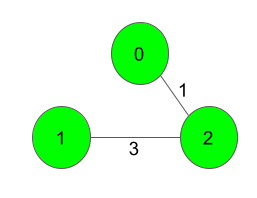
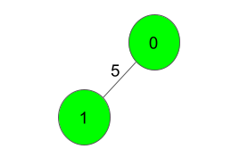

# [Minimum Spanning Tree](https://practice.geeksforgeeks.org/problems/minimum-spanning-tree/1)

                

Given a weighted, undirected and connected graph of V vertices and E edges. The task is to find the sum of weights of the edges of the&nbsp;Minimum Spanning Tree.

<strong>Example 1:</strong>

<pre><strong>Input:</strong>

<strong>Output:</strong>
4
<strong>Explanation</strong>:

The Spanning Tree resulting in a weight
of 4 is shown above.
</pre>

<strong>Example 2:</strong>

<pre><strong>Input:</strong>

<strong>Output:</strong>
5
<strong>Explanation</strong>:
Only one Spanning Tree is possible
which has a weight of 5.
</pre>

<strong>Your task:</strong> 
Since this is a functional problem you don't have to worry about input, you just have to complete the function&nbsp; <strong>spanningTree()</strong> which takes number of vertices V<strong> </strong>and<strong>&nbsp;</strong>an adjacency matrix adj as input parameters&nbsp;and returns an integer denoting the sum of weights of the edges of the Minimum Spanning Tree. Here adj[i] contains a list of lists containing two integers where the first integer j denotes that there is an edge between i and j and second integer w denotes that the distance between edge i and j is w.

<strong>Expected Time Complexity:&nbsp;</strong>O(ElogV). 
<strong>Expected Auxiliary Space:&nbsp;</strong>O(V2). 

<strong>Constraints:</strong> 
2  ≤  V ≤  1000 
V-1 ≤  E  ≤  (V*(V-1))/2 
1  ≤  w  ≤  1000 
Graph is connected and&nbsp;doesn't contain self loops &amp;&nbsp;multiple edges.

 

 

